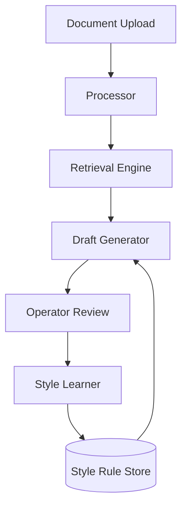

# Legal Drafting Assistant

An end-to-end AI-powered system designed for processing legal documents, generating evidence-grounded drafts, and improving through operator feedback.

---

## Features

- Document Processing: Automated text extraction from PDFs and text files.
- Semantic Retrieval: Vector search using ChromaDB to find relevant legal evidence.
- Grounded Drafting: Draft generation anchored in source evidence with citations.
- Style Learning: Learns writing style and formatting preferences from user edits.
- REST API: Full support for programmatic access and a web interface.

---

## System Architecture



---

## Getting Started

### Prerequisites
- Python 3.9 or higher
- API key (Groq, Gemini, or Anthropic)

### Installation

1. Clone the repository:
   ```bash
   git clone https://github.com/ApurboShib/Project_0.2.git
   cd Project_0.2
   ```

2. Run the setup script:
   ```bash
   chmod +x run.sh
   ./run.sh
   ```

3. Configure environment:
   Create a `.env` file in the root directory:
   ```env
   LLM_PROVIDER=groq
   GROQ_API_KEY=your_key_here
   LEGAL_AI_DATA_DIR=./data
   ```

4. Access the application:
   Open http://localhost:8000 in your browser.

---

## Usage Guide

### 1. Document Ingestion
Upload legal documents (PDF or TXT). The system indexes the content for semantic retrieval.

### 2. Drafting
Specialized draft types available:
- Case Fact Summary
- Internal Memo
- Notice Summary
- Document Checklist
- Title Review

### 3. Feedback Loop
Edit generated drafts to teach the system your style. Rules are extracted and applied to future drafts.

---

## API Reference

| Endpoint | Method | Description |
| :--- | :--- | :--- |
| /api/process | POST | Upload and process a new document |
| /api/draft | POST | Generate a new draft |
| /api/edit | POST | Submit edits for style learning |
| /api/documents | GET | List all processed documents |
| /api/rules | GET | View all learned style rules |

---

## Project Structure

```text
app/
├── core/             # Business logic & engines
├── api/              # FastAPI routes & schemas
├── templates/        # UI components
data/                 # Local persistence (SQLite, ChromaDB)
samples/              # Example documents
```

---

*Created by [Apurbo Shib](https://github.com/ApurboShib)*
