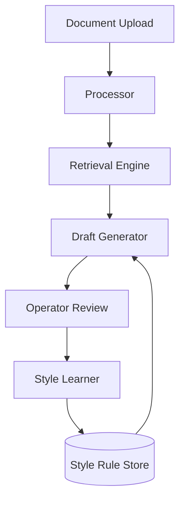

# Legal Drafting Assistant

An end-to-end AI-powered system designed for processing legal documents, generating evidence-grounded drafts, and improving through operator feedback.

---

## Features

- **Modern Web Interface**: Responsive design with Dark/Light mode, drag & drop upload, and real-time previews.
- **Document Processing**: Automated text extraction from PDFs and text files.
- **Semantic Retrieval**: Vector search using ChromaDB to find relevant legal evidence.
- **Grounded Drafting**: Draft generation anchored in source evidence with citations.
- **Interactive Feedback Loop**: 5-star rating system and detailed feedback to teach writing style and formatting preferences.
- **Robust API**: Full support for programmatic access via REST API with built-in Swagger/ReDoc documentation.
- **Secure Configuration**: Environment variable management using `python-dotenv`.

---

## System Architecture



---

## Getting Started

### Prerequisites
- Python 3.9 or higher
- API key (Groq, Gemini, or Anthropic)

### Installation

1. Clone the repository:
   ```bash
   git clone https://github.com/ApurboShib/Project_0.2.git
   cd Project_0.2
   ```

2. Run the setup script:
   ```bash
   chmod +x run.sh
   ./run.sh
   ```

3. Configure environment:
   Create a `.env` file in the root directory (or copy from `.env.example`):
   ```env
   LLM_PROVIDER=groq # or anthropic
   GROQ_API_KEY=your_key_here
   LEGAL_AI_DATA_DIR=./data
   ```

4. Access the application:
   The easiest way is to use the provided run script:
   ```bash
   ./run.sh
   ```
   Then open http://localhost:8000 in your browser.

---

## Testing

The project includes an automated test suite using `pytest`.

### Running Tests

To run the tests, ensure your virtual environment is active and run:
```bash
# Set PYTHONPATH to include the current directory
export PYTHONPATH=$PYTHONPATH:.
pytest tests/test_api.py
```

### Manual Verification
You can also verify the system by:
1. **Health Check**: Visit http://localhost:8000/api/health to see if the API is responsive.
2. **UI Test**: Upload a sample document from the `samples/` directory and generate a draft.
3. **API Test**: Use the sample `curl` commands in [QUICKSTART.md](QUICKSTART.md) to test the REST endpoints.
4. **Interactive Docs**: Explore and execute the API directly using the built-in documentation:
   - **Swagger UI**: [http://localhost:8000/docs](http://localhost:8000/docs)
   - **ReDoc**: [http://localhost:8000/redoc](http://localhost:8000/redoc)

---

## Usage Guide

### 1. Document Ingestion
Upload legal documents (PDF or TXT). The system indexes the content for semantic retrieval.

### 2. Drafting
Specialized draft types available:
- Case Fact Summary
- Internal Memo
- Notice Summary
- Document Checklist
- Title Review

### 3. Feedback Loop
Edit generated drafts to teach the system your style. Rules are extracted and applied to future drafts.

---

## API Reference

| Endpoint | Method | Description |
| :--- | :--- | :--- |
| /api/process | POST | Upload and process a new document |
| /api/draft | POST | Generate a new draft |
| /api/edit | POST | Submit edits for style learning |
| /api/documents | GET | List all processed documents |
| /api/rules | GET | View all learned style rules |

---

## Project Structure

```text
app/
├── core/             # Business logic & engines
├── api/              # FastAPI routes & schemas
├── templates/        # UI components
data/                 # Local persistence (SQLite, ChromaDB)
samples/              # Example documents
```

---

*Created by [Apurbo Shib](https://github.com/ApurboShib)*
