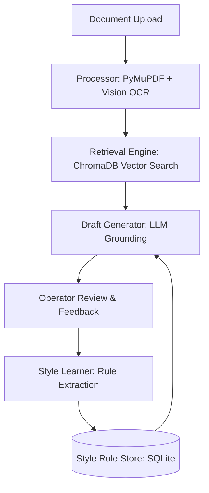

# ⚖️ Legal Drafting Assistant

[](https://www.python.org/downloads/)
[](https://opensource.org/licenses/MIT)
[](https://fastapi.tiangolo.com/)

An end-to-end AI-powered system designed for processing complex legal documents, generating evidence-grounded drafts, and continuously improving through operator feedback loops.

---

## 🌟 Key Features

- **📂 Intelligent Document Processing**: Automated text extraction from PDFs, images (via Vision OCR), and text files.
- **🔍 Semantic Retrieval Engine**: High-performance vector search using ChromaDB to find relevant legal precedents and evidence.
- **✍️ Grounded Drafting**: Draft generation strictly anchored in source evidence with precise citations to prevent hallucinations.
- **🧠 Continuous Style Learning**: Learns your specific legal writing style and formatting preferences from every edit you make.
- **🚀 Production Ready**: Full REST API support, responsive modern UI, and robust error handling.

---

## 🏗️ System Architecture



---

## 🚀 Getting Started

### Prerequisites
- Python 3.9 or higher
- An API key (Groq, Gemini, or Anthropic)

### Installation

1. **Clone the repository:**
   ```bash
   git clone https://github.com/ApurboShib/Project_0.2.git
   cd Project_0.2
   ```

2. **Run the setup script:**
   ```bash
   chmod +x run.sh
   ./run.sh
   ```

3. **Configure your environment:**
   Create a `.env` file in the root directory (or copy from `.env.example`):
   ```env
   LLM_PROVIDER=groq
   GROQ_API_KEY=your_key_here
   LEGAL_AI_DATA_DIR=./data
   ```

4. **Access the application:**
   Open [http://localhost:8000](http://localhost:8000) in your browser.

---

## 📖 Usage Guide

### 1. Document Ingestion
Upload any legal document (PDF, TXT, or MD). The system will automatically chunk and index the content for semantic retrieval.

### 2. Drafting
Choose from several specialized draft types:
- **Case Fact Summary**: For litigation and complaints.
- **Internal Memo**: Strategic working papers for attorneys.
- **Notice Summary**: For contract terminations and legal notices.
- **Document Checklist**: For compliance and requirements tracking.
- **Title Review**: For contract and property analysis.

### 3. Feedback Loop
After a draft is generated, you can edit it directly. The system analyzes your changes to extract **Style Rules** (e.g., "Always use 'the Company' instead of full names"), which are automatically applied to all future drafts of that type.

---

## 🛠️ API Reference

| Endpoint | Method | Description |
| :--- | :--- | :--- |
| `/api/process` | `POST` | Upload and process a new document |
| `/api/draft` | `POST` | Generate a new draft based on processed docs |
| `/api/edit` | `POST` | Submit edits and trigger style learning |
| `/api/documents` | `GET` | List all processed documents |
| `/api/rules` | `GET` | View all learned style rules |

---

## 📁 Project Structure

```text
app/
├── core/             # Business logic & engines
├── api/              # FastAPI routes & schemas
├── templates/        # UI components
data/                 # Local persistence (SQLite, ChromaDB)
samples/              # Example documents & outputs
```

---

## 🛡️ Security & Privacy

- **Grounded Responses**: The system is designed to minimize hallucinations by strictly citing source material.
- **Local Storage**: All processed data and learned rules are stored locally in the `data/` directory.
- **Environment Safety**: Secrets are managed via `.env` files and are never committed to the repository.

---

## 📄 License

Distributed under the MIT License. See `LICENSE` for more information.

---
*Created by [Apurbo Shib](https://github.com/ApurboShib)*
