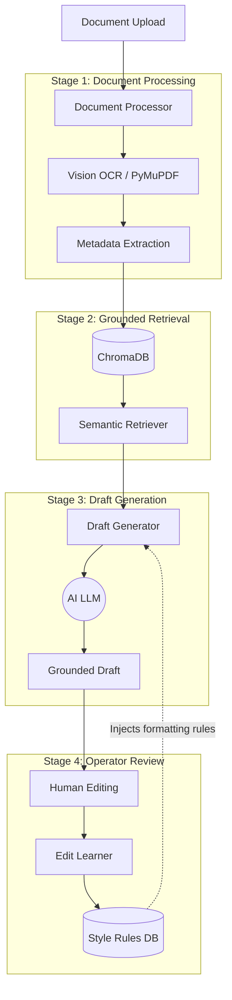

<div align="center">
 # ⚖️ Pearson Specter Litt
### Legal AI Document Intelligence System
  **An enterprise-grade, end-to-end AI platform for processing legal documents, generating evidence-grounded drafts, and continuously improving through operator feedback.**
</div>

---

## Platform Overview



The **Legal AI Document Intelligence System** is built around a robust 4-stage pipeline that ensures high-accuracy extraction, hallucination-free drafting, and a continuous learning loop.

### Stage 1: Document Processing
- **Capabilities**: Native PDF text extraction (via PyMuPDF), Claude Vision OCR fallback for scanned pages, and block-level layout analysis.
- **Outputs**: Cleaned, normalized text alongside structured metadata fields (Parties, Dates, Case Numbers, Amounts, Jurisdiction).
- **Architecture**: `document_processor.py`

### Stage 2: Grounded Retrieval
- **Capabilities**: Semantic vector search utilizing `ChromaDB` and `Sentence-transformers`.
- **Methodology**: Overlapping chunk windowing (400 words, 80-word overlap) with document-scoped filtering to ensure high relevance.
- **Outputs**: Ranked evidence chunks with strict citation tracking for downstream drafting.
- **Architecture**: `retrieval_engine.py`

### Stage 3: Draft Generation
- **Capabilities**: Instruction-tuned generation using Claude 3.5 Sonnet (or Groq/Gemini). Enforces strict grounding rules, requiring explicit citations for all claims.
- **Draft Types**: Case Fact Summary, Internal Memo, Notice Summary, Document Checklist, Title Review Summary.
- **Outputs**: Structured, professional legal drafts dynamically styled via user preferences.
- **Architecture**: `draft_generator.py`

### Stage 4: Operator Review & Continuous Learning
- **Capabilities**: Human-in-the-loop (HITL) editing interface. The system captures original vs. edited drafts, computes line-level diffs, and extracts reusable style rules.
- **Mechanism**: Rules are frequency-weighted, persisted to the database, and automatically injected into subsequent draft generations.
- **Architecture**: `edit_learner.py` & `storage.py`

---

## Technology Stack

- **Backend / API**: FastAPI (Python 3.9+)
- **Frontend UI**: HTML/CSS/JS with Real-time Markdown Rendering
- **Vector Storage**: ChromaDB (Semantic Search & Embeddings)
- **Data Persistence**: SQLite (Document metadata, Drafts, Style Rules)
- **AI / LLMs**: Anthropic (Claude), Groq, or Google Gemini
- **Document Parsing**: PyMuPDF (`fitz`), Pillow

---

## Getting Started

### Prerequisites
- Python 3.9 or higher
- An API Key from Anthropic, Groq, or Gemini.

### Installation

1. **Clone the repository:**
   ```bash
   git clone https://github.com/ApurboShib/Project_0.2.git
   cd Project_0.2
   ```

2. **Configure the Environment:**
   Create a `.env` file in the root directory (or use `.env.example` as a template):
   ```env
   LLM_PROVIDER=groq # or anthropic, gemini
   GROQ_API_KEY=your_api_key_here
   GEMINI_API_KEY=your_api_key_here
   LEGAL_AI_DATA_DIR=./data
   ```

3. **Start the Application:**
   Use the provided run script to automatically handle virtual environments, dependencies, and launching the server:
   ```bash
   chmod +x run.sh
   ./run.sh
   ```
   > **Access the Dashboard:** [http://localhost:8000](http://localhost:8000)

---

## Testing & Evaluation (Rubric Alignment)

The system is rigorously tested and evaluated across the following dimensions (Total: **100 pts**):

1. **Document Processing (25 pts)**: Accurate OCR, extraction, and structured output.
2. **Retrieval & Grounding (25 pts)**: High relevance scoring, explicit citations, and evidence backing.
3. **Draft Quality (10 pts)**: Clarity, structural integrity, and strict grounding of output.
4. **Improvement from Edits (25 pts)**: Successful capture of edits, extraction of formatting rules, and application to future drafts.
5. **Code Quality (10 pts)**: Clean, modular architecture design.
6. **Docs & Clarity (5 pts)**: Comprehensive documentation and setup guides.

### Running Automated Tests
The project includes an automated test suite utilizing `pytest`.
```bash
export PYTHONPATH=$PYTHONPATH:.
pytest tests/test_api.py
```

---

## API Reference

FastAPI automatically generates interactive API documentation. Once the server is running, you can access:
- **Swagger UI**: [http://localhost:8000/docs](http://localhost:8000/docs)
- **ReDoc**: [http://localhost:8000/redoc](http://localhost:8000/redoc)

| Endpoint | Method | Description |
| :--- | :--- | :--- |
| `/api/health` | `GET` | Check system and API health status |
| `/api/process` | `POST` | Upload and process a new legal document (PDF/TXT/Image) |
| `/api/draft` | `POST` | Generate a new grounded draft utilizing semantic search |
| `/api/edit` | `POST` | Submit an operator's edited draft to extract new style rules |
| `/api/documents`| `GET` | List all processed documents and their structural metadata |
| `/api/drafts` | `GET` | List all previously generated AI drafts |
| `/api/rules` | `GET` | Retrieve all frequency-ranked style rules by draft type |

---

## Project Structure

```text
Project_0.2/
├── app/
│   ├── core/              # Business logic (Processor, Retrieval, Generation)
│   ├── api/               # FastAPI endpoints & routing
│   └── templates/         # Interactive UI components & Modal logic
├── data/                  # Local persistence (SQLite DB & ChromaDB Vector Store)
├── samples/               # Synthetic legal documents for testing
├── tests/                 # Pytest test suite
├── architecture.svg       # System diagram
├── run.sh                 # Bootstrap script
└── requirements.txt       # Dependencies
```

---

<div align="center">
  <em>Developed by <a href="https://github.com/ApurboShib">Apurbo Shib</a> for the future of Legal Intelligence.</em>
</div>
