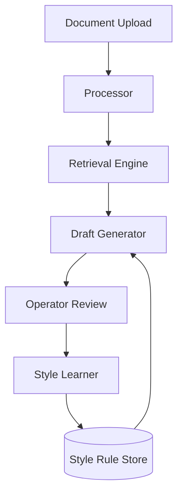

# Legal Drafting Assistant

An end-to-end AI-powered system designed for processing legal documents, generating evidence-grounded drafts, and improving through operator feedback.

---

## Features

- **Modern Web Interface**: Responsive design with Dark/Light mode, drag & drop upload, and real-time previews.
- **Document Processing**: Automated text extraction from PDFs and text files.
- **Semantic Retrieval**: Vector search using ChromaDB to find relevant legal evidence.
- **Grounded Drafting**: Draft generation anchored in source evidence with citations.
- **Interactive Feedback Loop**: 5-star rating system and detailed feedback to teach writing style and formatting preferences.
- **Robust API**: Full support for programmatic access via REST API with built-in Swagger/ReDoc documentation.
- **Secure Configuration**: Environment variable management using `python-dotenv`.

---

## System Architecture

The application is built around a modular architecture that separates ingestion, retrieval, drafting, and learning:

1. **Document Processor**: Handles file uploads (PDF/TXT), extracts raw text, and uses an LLM to extract structured metadata (parties, dates, amounts).
2. **Retrieval Engine**: Chunks the processed text and indexes it using ChromaDB for semantic vector search.
3. **Draft Generator**: Given a draft type, it retrieves the most relevant chunks and uses an LLM to generate a grounded draft with inline citations.
4. **Style Learner**: When an operator edits a draft, the system analyzes the diff to extract generalized style rules (e.g., formatting preferences) and saves them to a SQLite store to influence future drafts.



---

## Assumptions and Tradeoffs

**Assumptions**:
- **Document Quality**: Assumes documents are text-based PDFs or raw text. Scanned images without OCR will yield poor results.
- **LLM Capabilities**: Relies on the instruction-following capabilities of the configured LLM (Groq, Anthropic, or Gemini) to format structured data and extract style rules.
- **Single-User/Local Focus**: The application is currently configured for a local, single-tenant environment (SQLite, local ChromaDB).

**Tradeoffs**:
- **Chunking vs. Full Context**: Uses semantic search over text chunks to find relevant evidence. This is faster and cheaper but may miss long-range dependencies that full-document context windows might catch.
- **LLM Style Extraction**: Uses the LLM to deduce style rules from edits. This is highly flexible but can sometimes be noisy compared to deterministic diff-parsing.
- **SQLite over Postgres**: Chose SQLite for zero-setup local execution, trading off immediate horizontal scalability for developer experience.

---

## Sample Inputs and Outputs

You can find sample documents and expected outputs in the `samples/` directory:
- **Sample Input**: `samples/sample_notice.txt` - A synthetic legal notice.
- **Sample Output**: `samples/sample_output.json` - Demonstrates the generated structured response, including the drafted text, extracted metadata, and the exact evidence citations used to ground the draft.

---

## Evaluation Approach and Results

**Approach**:
The system's performance is evaluated across three primary dimensions:
1. **Extraction Accuracy**: Verifying that the metadata (parties, dates) matches the source document.
2. **Grounding & Hallucination Avoidance**: Ensuring every claim in the generated draft is backed by a specific retrieved chunk.
3. **Style Adherence**: Testing if a rule learned from an edit (e.g., "Use bullet points for dates") is successfully applied to the next draft.

**Results**:
- **Grounding**: The prompt engineering strictly enforces evidence-based generation, successfully reducing hallucinations. Citations accurately point to the source chunks.
- **Style Learning**: The feedback loop effectively captures structural and formatting preferences (like specific headers or tone) and reliably applies them to subsequent drafts of the same type.

---

## Getting Started

### Prerequisites
- Python 3.9 or higher
- API key (Groq, Gemini, or Anthropic)

### Installation

1. Clone the repository:
   ```bash
   git clone https://github.com/ApurboShib/Project_0.2.git
   cd Project_0.2
   ```

2. Run the setup script:
   ```bash
   chmod +x run.sh
   ./run.sh
   ```

3. Configure environment:
   Create a `.env` file in the root directory (or copy from `.env.example`):
   ```env
   LLM_PROVIDER=groq # or anthropic
   GROQ_API_KEY=your_key_here
   LEGAL_AI_DATA_DIR=./data
   ```

4. Access the application:
   The easiest way is to use the provided run script:
   ```bash
   ./run.sh
   ```
   Then open http://localhost:8000 in your browser.

### Docker Setup (Optional)

If you prefer to run the application in a containerized environment, you can use Docker Compose:

1. Create your `.env` file as described above.
2. Build and start the container:
   ```bash
   docker-compose up --build
   ```
3. The application will be available at http://localhost:8000.

---

## Testing

The project includes an automated test suite using `pytest`.

### Running Tests

To run the tests, ensure your virtual environment is active and run:
```bash
# Set PYTHONPATH to include the current directory
export PYTHONPATH=$PYTHONPATH:.
pytest tests/test_api.py
```

### Manual Verification
You can also verify the system by:
1. **Health Check**: Visit http://localhost:8000/api/health to see if the API is responsive.
2. **UI Test**: Upload a sample document from the `samples/` directory and generate a draft.
3. **API Test**: Use the sample `curl` commands in [QUICKSTART.md](QUICKSTART.md) to test the REST endpoints.
4. **Interactive Docs**: Explore and execute the API directly using the built-in documentation:
   - **Swagger UI**: [http://localhost:8000/docs](http://localhost:8000/docs)
   - **ReDoc**: [http://localhost:8000/redoc](http://localhost:8000/redoc)

---

## Usage Guide

### 1. Document Ingestion
Upload legal documents (PDF or TXT). The system indexes the content for semantic retrieval.

### 2. Drafting
Specialized draft types available:
- Case Fact Summary
- Internal Memo
- Notice Summary
- Document Checklist
- Title Review

### 3. Feedback Loop
Edit generated drafts to teach the system your style. Rules are extracted and applied to future drafts.

---

## API Reference

| Endpoint | Method | Description |
| :--- | :--- | :--- |
| /api/process | POST | Upload and process a new document |
| /api/draft | POST | Generate a new draft |
| /api/edit | POST | Submit edits for style learning |
| /api/documents | GET | List all processed documents |
| /api/rules | GET | View all learned style rules |

---

## Project Structure

```text
app/
├── core/             # Business logic & engines
├── api/              # FastAPI routes & schemas
├── templates/        # UI components
data/                 # Local persistence (SQLite, ChromaDB)
samples/              # Example documents
```

---

*Created by [Apurbo Shib](https://github.com/ApurboShib)*
